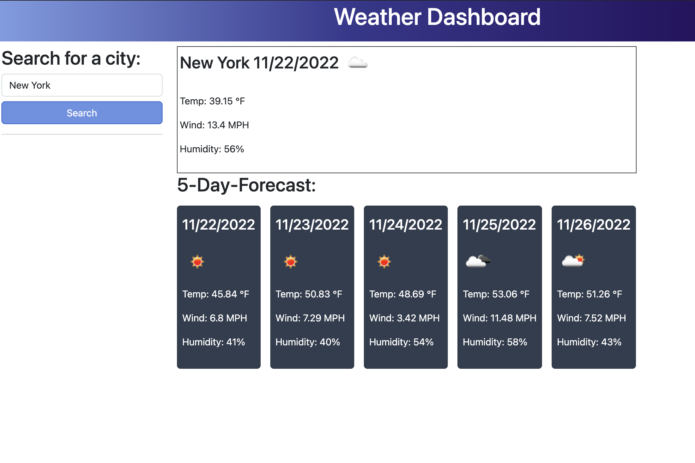

# ryans-weather-forecast

## Deployment

[Deployed page](https://rdalby2002.github.io/ryans-weather-forecast/)

## Description

In order to give people a convenient and easy to use method of planning around the weather, I created this weather dashboard, where one can look up a city, and be presented with its current weather conditions, as well as the predicted conditions for the following five days. In doing so, I utilized the OpenWeather's Geocoding and 5 day, 3 hour forecast server-side API's; the former, in order to gather the latitude and longitude of the user's searched city, to then be used in the latter's API call. In creating this project, I gained a much deeper understanding of server-side API calls, responses, and how to get specific pieces of data from said responses.

## Installation

N/A

## Usage

To use, type the name of the desired city into the input field and click the search button. You'll then be presented with both the city's current conditions and a 5 day forecast. This is demonstrated in the following screenshot:

## Credits

N/A

## License

MIT

---
